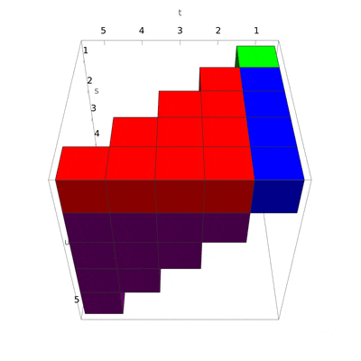
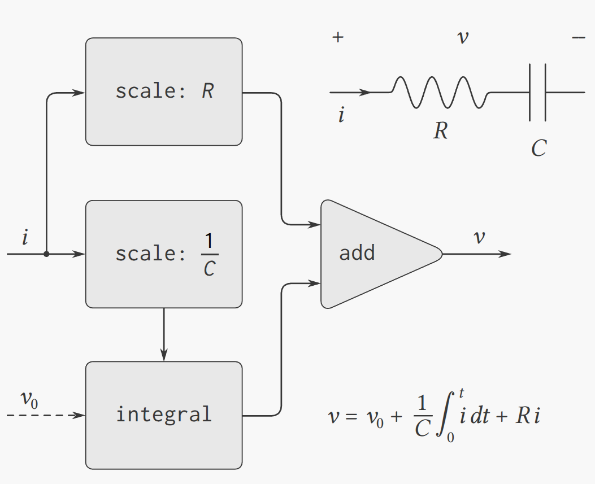

<div class="nav">
    <span class="activenav"><a href="notes-ch3-4.html">← Previous</a></span>
    <span class="activenav"><a href="../index.html">↑ Up</a></span>
    <span class="activenav"><a href="../ch4/notes-ch4-1.html">Next →</a></span>
</div>

[HTML Book Chapter 3.5 Link](https://sarabander.github.io/sicp/html/3_002e5.xhtml#g_t3_002e5)

@toc

## Section 3.5

### Examples and Notes

@src(code/example-3-5-1.rkt, collapsed)

@src(code/example-3-5-2.rkt)

@src(code/example-3-5-3.rkt)

Note to self: I had a half-thought-out concern about the caching. In the solution
to 3.55:

```rkt
(define (partial-sums s)
  (cons-stream 0
    (add-streams s (partial-sums s))))
```

I'd be concerned that if `(partial-sums s)` created a new stream with new 
cached values at every step, that we wouldn't get the additive behavior we want?
Does this make any sense? Can I replicate and understand this with just lambdas?

### Exercises

#### Exercise 3.50

Complete the following
definition, which generalizes `stream-map` to allow procedures that take
multiple arguments, analogous to `map` in 2.2.1, 
Footnote 78.

```rkt
(define (stream-map proc . argstreams)
  (if (⟨??⟩ (car argstreams))
      the-empty-stream
      (⟨??⟩
       (apply proc (map ⟨??⟩ argstreams))
       (apply stream-map
              (cons proc 
                    (map ⟨??⟩ 
                         argstreams))))))
```

##### Solution

```rkt
(define (stream-map proc . argstreams)
  (if (stream-null? (car argstreams))
      the-empty-stream
      (cons-stream
       (apply proc (map stream-car argstreams))
       (apply stream-map (cons proc (map stream-cdr argstreams))))))

;; Enumerate every other triangular number
;; ie every other entry from the sequence  
;; 1, 3, 6, 10, 15, 21, 28, 36, 45, 55, ... n*(n+1)/2
(display-stream 
  (stream-map 
   * 
   (stream-enumerate-evens 1 10)
   (stream-enumerate-odds 1 10)
   (stream-enumerate-constant 1/2 5)))
```

@src(code/ex3-50.rkt,collapsed)


***Note*** I wrote a really really bad definition of stream-map on a first pass!!!
The following definition has major issues because `rest` is evaluated immediately. 
In fact it *has* to be inside cons-stream (where the second argument is delayed)
to avoid infinite recursion in scenarios like in problem 3.53.

```rkt
;; bad awful definition of stream-map
(define (stream-map proc . argstreams)
  (if (stream-null? (car argstreams))
      the-empty-stream
      (let ((args (map stream-car argstreams))
            (rest (map stream-cdr argstreams)))
        (cons-stream
         (apply proc args)
         (apply stream-map (cons proc rest))))))
```

#### Exercise 3.51

In order to take a closer look at
delayed evaluation, we will use the following procedure, which simply returns
its argument after printing it:

```rkt
(define (show x)
  (display-line x)
  x)
```

What does the interpreter print in response to evaluating each expression in
the following sequence?

```rkt
(define x 
  (stream-map 
   show 
   (stream-enumerate-interval 0 10)))

(stream-ref x 5)
(stream-ref x 7)
```

##### Solution

Zero is printed right when we define x, 
because with our definitions the first element of the 
stream is computed right away.

```rkt
(define (show x)
  (display-line x)
  x)

(define x
  (stream-map
   show
   (stream-enumerate-interval 0 10)))
; 0
```

Next, we compute stream-ref, and we print the following,
no surprises yet:
```rkt
(stream-ref x 5)
; 1
; 2
; 3
; 4
; 5 <- from (newline) (display 5)
; 5 <- from the output of the function
```

When we print 7, we find that only the results for elements
6 and 7 are printed, because all other entries have been 
memoized.

```rkt
(stream-ref x 7)
; 6
; 7 <- from (newline) (display 5)
; 7 <- from the output of the function
```

@src(code/ex3-51.rkt, collapsed)

#### Exercise 3.52

Consider the sequence of
expressions

```rkt
(define sum 0)

(define (accum x)
  (set! sum (+ x sum))
  sum)

(define seq 
  (stream-map 
   accum 
   (stream-enumerate-interval 1 20)))

(define y (stream-filter even? seq))

(define z 
  (stream-filter 
   (lambda (x) 
     (= (remainder x 5) 0)) seq))

(stream-ref y 7)
(display-stream z)
```

What is the value of `sum` after each of the above expressions is
evaluated?  What is the printed response to evaluating the `stream-ref`
and `display-stream` expressions?  Would these responses differ if we had
implemented `(delay ⟨exp⟩)` simply as `(lambda () ⟨exp⟩)`
without using the optimization provided by `memo-proc`?  Explain.

##### Solution

The evaluations would be very different if we didn't memoize. Each time we evaluate a term
using `stream-cdr`, we modify `sum`, and so if we wanted to regenerate the earlier portions of the list,
we'd have to reset `sum` to zero every time we did an operation.

With memoization we get the following:

```rkt
(define sum 0)

(define (accum x)
  (set! sum (+ x sum))
  sum)

(define seq 
  (stream-map 
   accum 
   (stream-enumerate-interval 1 20)))
;; display stream would print:
;; 1, 3, 6, 10, 15, 21, 28, 36, 45, 55, 66, 78, 91, 105, 120, 136, 153, 171, 190, 210

(define y (stream-filter even? seq))
;; Evens: 6, 10, 28, 36, 66, 78, 120, 136, 190, 210

(define z 
  (stream-filter 
   (lambda (x) 
     (= (remainder x 5) 0)) seq))
;; Divisible by 5: 10, 15, 45, 55, 105, 120, 190, 210

(stream-ref y 7)
;; 136, the seventh even triangular number
(display-stream z)
;; Prints 10, 15, 45, 55, 105, 120, 190, 210
```

@src(code/ex3-52.rkt, collapsed)

#### Exercise 3.53

Without running the program,
describe the elements of the stream defined by

```rkt
(define s (cons-stream 1 (add-streams s s)))
```

##### Solution


`stream-car` of s trivially runs fine and returns 1. 

The interesting stuff is when we call 
`stream-cdr`. We do `force` to evaluate `add-streams`, this looks something like

```rkt
(add-streams 
  (cons-stream 1 (add-streams s s))
  (cons-stream 1 (add-streams s s)))
```

We create a new stream which looks like this:

```rkt
(cons-stream
  (+ 1 1)
  (add-streams 
    (add-streams s s)
    (add-streams s s)))
```

We might expect this to give an infinite recursion, but in fact the second 
argument is delayed, and so doesn't evaluate. (if it evaluated, we'd be in trouble.)

Double checking by evaluating:

@src(code/ex3-53.rkt, collapsed)

#### Exercise 3.54

Define a procedure
`mul-streams`, analogous to `add-streams`, that produces the
elementwise product of its two input streams.  Use this together with the
stream of `integers` to complete the following definition of the stream
whose $n^{\text{th}}$ element (counting from 0) is $n + 1$ factorial:

```rkt
(define factorials 
  (cons-stream 1 (mul-streams ⟨??⟩ ⟨??⟩)))
```
##### Solution

```rkt
(define (mul-streams s1 s2)
  (stream-map * s1 s2))
(define factorials
  (cons-stream 1 (mul-streams integers factorials)))
```

@src(code/ex3-54.rkt, collapsed)


#### Exercise 3.55

Define a procedure
`partial-sums` that takes as argument a stream $S$ and returns the
stream whose elements are $S_0$, $S_0 + S_1$, $S_0 + S_1 + S_2, \dots $.  
For example, `(partial-sums integers)` should be the
stream 1, 3, 6, 10, 15, $\ldots$.

##### Solution

```rkt
(define (partial-sums s)
  (cons-stream 0
    (add-streams s (partial-sums s))))
```

@src(code/ex3-55.rkt, collapsed)

#### Exercise 3.56

A famous problem, first raised by
R. Hamming, is to enumerate, in ascending order with no repetitions, all
positive integers with no prime factors other than 2, 3, or 5.  One obvious way
to do this is to simply test each integer in turn to see whether it has any
factors other than 2, 3, and 5.  But this is very inefficient, since, as the
integers get larger, fewer and fewer of them fit the requirement.  As an
alternative, let us call the required stream of numbers `S` and notice the
following facts about it.

- `S` begins with 1.
- The elements of `(scale-stream S 2)` are also elements of `S`.
- The same is true for `(scale-stream S 3)`
and `(scale-stream S 5)`.
- These are all the elements of `S`.

Now all we have to do is combine elements from these sources.  For this we
define a procedure `merge` that combines two ordered streams into one
ordered result stream, eliminating repetitions:

```rkt
(define (merge s1 s2)
  (cond ((stream-null? s1) s2)
        ((stream-null? s2) s1)
        (else
         (let ((s1car (stream-car s1))
               (s2car (stream-car s2)))
           (cond ((< s1car s2car)
                  (cons-stream 
                   s1car 
                   (merge (stream-cdr s1) 
                          s2)))
                 ((> s1car s2car)
                  (cons-stream 
                   s2car 
                   (merge s1 
                          (stream-cdr s2))))
                 (else
                  (cons-stream 
                   s1car
                   (merge 
                    (stream-cdr s1)
                    (stream-cdr s2)))))))))
```

Then the required stream may be constructed with `merge`, as follows:

```rkt
(define S (cons-stream 1 (merge ⟨??⟩ ⟨??⟩)))
```

Fill in the missing expressions in the places marked `⟨??⟩` above.

##### Solution

@src(code/ex3-56.rkt,collapsed)

#### Exercise 3.57

How many additions are performed
when we compute the $n^{\text{th}}$ Fibonacci number using the definition of
`fibs` based on the `add-streams` procedure?  Show that the number of
additions would be exponentially greater if we had implemented `(delay ⟨exp⟩)` 
simply as `(lambda () ⟨exp⟩)`, without using the
optimization provided by the `memo-proc` procedure described in 
3.5.1.

##### Solution

With caching, we only call `+` once each time we iterate to
the next value. 

Without caching, we see that the only base cases are 0 and 1, so we call + at least `Fib(n)` times to calculate `Fib(n)`, probably more if many of them are adding `(+ n 0)`. 

@src(code/ex3-57.rkt)

#### Exercise 3.58

Give an interpretation of the
stream computed by the following procedure:

```rkt
(define (expand num den radix)
  (cons-stream
   (quotient (* num radix) den)
   (expand (remainder (* num radix) den) 
           den 
           radix)))
```

(`Quotient` is a primitive that returns the integer quotient of two
integers.)  What are the successive elements produced by `(expand 1 7
10)`?  What is produced by `(expand 3 8 10)`?

##### Solution

This is a base-`radix` expansion of the rational number `(/ num den)`, where we expect 

$$\frac{\texttt{num}}{\texttt{den}}\lt 1.$$

The first digit in base-`radix` is $c_1=\lfloor \texttt{num}\cdot \texttt{rad}/\texttt{den}\rfloor.$

Next we compute the remainder, 
$$\frac{n}{d}=\frac{c_1}{r}+\frac{nr-c_1 d}{dr}.$$

We note that the numerator is exactly `(remainder (* num radix) den)`. 

For the next digit, we do the same thing. 

$$\frac{n}{d}=\frac{c_1}{r}+\frac{c_2}{r^2}+\frac{(nr -c_1 d)r-c_2 d}{dr^2}.$$

Where $c_2$ can be calculated as `(remainder (* num-new radix) den)`.

So we can see how this could be turned into an inductive proof
that our algorithm is correct.

For the first example, `(expand 1 7 10)` will give the repeating
decimal digits of 1/7. For `(expand 3 8 10)` we expect the 
sequence `'(3 7 5 0 0 0 ...)`.

@src(code/ex3-58.rkt, collapsed)

#### Exercise 3.59

In 2.5.3 we saw how
to implement a polynomial arithmetic system representing polynomials as lists
of terms.  In a similar way, we can work with power series, such as

<div>$$\begin{align*}
  e^x &= 1 + x + \frac{1}{2} x^2  + \frac{1}{3 \cdot 2} x^3  + \frac{1}{4 \cdot 3 \cdot 2} x^4  + \dots \\
  \cos x  &= 1 - \frac{1}{2} x^2  + \frac{1}{4 \cdot 3 \cdot 2} x^4  - \dots \\
  \sin x  &= x - \frac{1}{3 \cdot 2} x^3  + \frac{1}{5 \cdot 4 \cdot 3 \cdot 2} x^5  - \dots
\end{align*}
$$</div>

represented as infinite streams.  We will represent the series $a_0 +
a_1 x + a_2 x^2 + a_3 x^3 + \dots$ as the stream whose
elements are the coefficients $a_0$, $a_1$, $a_2$, $a_3$, $\cdots$.

**1.** The integral of the series $a_0 + a_1 x + a_2 x^2 + a_3 x^3 + \dots$ is the series

$$c + {a_0 x} + {\frac{1}{2} a_1 x^2} + {\frac{1}{3} a_2 x^3} + {\frac{1}{4} a_3 x^4 + \dots,}$$


where $c$ is any constant.  Define a procedure `integrate-series` that
takes as input a stream $a_0$, $a_1$, $a_2$, $\ldots$ representing a power
series and returns the stream $a_0$, ${{1\over2}a_1}$, ${{1\over3}a_2}$, $\ldots$ of
coefficients of the non-constant terms of the integral of the series.  (Since
the result has no constant term, it doesn't represent a power series; when we
use `integrate-series`, we will `cons` on the appropriate constant.)

**2.** The function ${x \mapsto e^x}$ is its own derivative.  This implies that
$e^x$ and the integral of $e^x$ are the same series, except for the
constant term, which is ${e^0 = 1}$.  Accordingly, we can generate the series
for $e^x$ as

```rkt
(define exp-series
  (cons-stream 
   1 (integrate-series exp-series)))
```

Show how to generate the series for sine and cosine, starting from the facts
that the derivative of sine is cosine and the derivative of cosine is the
negative of sine:

```rkt
(define cosine-series 
  (cons-stream 1 ⟨??⟩))

(define sine-series
  (cons-stream 0 ⟨??⟩))
```

##### Solution

We just define the series as integrals as each other:

```rkt
(define cosine-series
  (cons-stream 1 
    (integrate-series 
      (negate-series sine-series))))
(define sine-series
  (cons-stream 0 
    (integrate-series cosine-series)))
```

@src(code/ex3-59.rkt,collapsed)


#### Exercise 3.60

With power series represented as
streams of coefficients as in Exercise 3.59, adding series is implemented
by `add-streams`.  Complete the definition of the following procedure for
multiplying series:

```rkt
(define (mul-series s1 s2)
  (cons-stream ⟨??⟩ (add-streams ⟨??⟩ ⟨??⟩)))
```

You can test your procedure by verifying that ${\sin^2x + \cos^2x = 1,$}
using the series from Exercise 3.59.

##### Solution

Take two formal power series $P_1=\sum_{n=0}^\infty P^1_n x^n$ and $P_2=\sum_{n=0}^\infty P^2_n x^n.$ We'll call 
$\texttt{CAR}(P_1)=P^1_0$ and $\texttt{CDR}(P_1)=\sum_{n=1}^\infty P^1_0.$
Then we apply a recursive definition of polynomial multiplication:

$$P_1\times P_2 = \texttt{CAR}(P_1)\cdot P_2 + (0 + \texttt{CDR}(P_1)\times P_2)$$

This is realized in the following algorithm:
```rkt
(define (mul-series s1 s2)
  (add-streams 
    (scale-stream s2 (stream-car s1))
    (cons-stream 0 (mul-series (stream-cdr s1) s2))))
```

Using the sum of cosine and sine squared as a test case:

@src(code/ex3-60.rkt,collapsed)

#### Exercise 3.61

Let $S$ be a power series
(Exercise 3.59) whose constant term is 1.  Suppose we want to find the
power series $1 / S$, that is, the series $X$ such that $SX = 1$.
Write $S = 1 + S_R$ where $S_R$ is the part of $S$ after the
constant term.  Then we can solve for $X$ as follows:

<div>$$\begin{align*}
  S \cdot X           &=   1, \\
  (1 + S_R) \cdot X   &=   1, \\
  X + S_R \cdot X     &=   1, \\
  X                   &=   1 - S_R \cdot X.
\end{align*}$$</div>

In other words, $X$ is the power series whose constant term is 1 and whose
higher-order terms are given by the negative of $S_R$ times $X$.  Use
this idea to write a procedure `invert-unit-series` that computes $1 / S$
for a power series $S$ with constant term 1.  You will need to use
`mul-series` from Exercise 3.60.

##### Solution

It feels like it should be more complicated than this, but this works
perfectly well!

```rkt
(defie (invert-unit-series S)
  (if (not (= 1 (stream-car S)))
    (error "In invert-unit-series first element is not 1!")
    (let ((SR (stream-cdr S)))
      (define X 
        (cons-stream 1 (negate-series (mul-series SR X))))
      X)))
```

@src(code/ex3-61.rkt, collapsed)

#### Exercise 3.62

Use the results of Exercise 3.60 
and Exercise 3.61 to define a procedure `div-series` that
divides two power series.  `Div-series` should work for any two series,
provided that the denominator series begins with a nonzero constant term.  (If
the denominator has a zero constant term, then `div-series` should signal
an error.)  Show how to use `div-series` together with the result of
Exercise 3.59 to generate the power series for tangent.

##### Solution

Pretty straightforward:

```rkt
(define (invert-series S)
  (if (= 0 (stream-car S))
    (error "In invert-series first element cannot be 0.")
    (let ((S0 (stream-car S)))
      (scale-stream (invert-unit-series (scale-stream S (/ 1 S0)))
                    (/ 1 S0)))))

(define (div-series S1 S2)
  (mul-series S1 (invert-series S2)))

(define tan-series
  (div-series sine-series cosine-series))
```

@src(code/ex3-62.rkt,collapsed)

#### Exercise 3.63

Louis Reasoner asks why the
`sqrt-stream` procedure was not written in the following more
straightforward way, without the local variable `guesses`:

```rkt
(define (sqrt-stream x)
  (cons-stream 
   1.0
   (stream-map (lambda (guess)
                 (sqrt-improve guess x))
               (sqrt-stream x))))
```

Alyssa P. Hacker replies that this version of the procedure is considerably
less efficient because it performs redundant computation.  Explain Alyssa's
answer.  Would the two versions still differ in efficiency if our
implementation of `delay` used only `(lambda () ⟨exp⟩)` without
using the optimization provided by `memo-proc` (3.5.1)?

##### Solution

This was quite confusing to me, but here is another way to "sabotage" the original code:
replace "guesses" with a function.

```rkt
(define (sqrt-stream x)
  (define (guesses)
    (cons-stream 
     1.0
     (stream-map (lambda (guess)
                   (sqrt-improve guess x))
                 (guesses))))
  (guesses))
```

Right, the point here is that every call to `(guesses)` has to build the stream
again from scratch. Since this is called recursively, that's a big problem! 


#### Exercise 3.64

Write a procedure
`stream-limit` that takes as arguments a stream and a number (the
tolerance).  It should examine the stream until it finds two successive
elements that differ in absolute value by less than the tolerance, and return
the second of the two elements.  Using this, we could compute square roots up
to a given tolerance by

```rkt
(define (sqrt x tolerance)
  (stream-limit (sqrt-stream x) tolerance))
```

##### Solution

```rkt
(define (stream-limit stream tol)
  (define (iter str last-elem)
    (let ((this-elem (stream-car str)))
      (if (< (abs (- this-elem last-elem)) tol) 
        this-elem
        (iter (stream-cdr str) this-elem))))
  (iter (stream-cdr stream) (stream-car stream)))
```

@src(code/ex3-64.rkt,collapsed)

#### Exercise 3.65

Use the series

$$\ln 2 \,=\, 1 - {1\over2} + {1\over3} - {1\over4} + \dots  $$


to compute three sequences of approximations to the natural logarithm of 2, in
the same way we did above for $\pi$.  How rapidly do these sequences
converge?


##### Solution

Very trivial modifications of the pi code above. Note the exact value to 
sixteen places is

$$\ln(2)=0.6931471805599453\ldots$$

We get 12 digits of accuracy after 6 steps (excluding the first 0).

@src(code/ex3-65.rkt,collapsed)
#### Exercise 3.66

Examine the stream `(pairs
integers integers)`. Can you make any general comments about the order in which
the pairs are placed into the stream? For example, approximately how many pairs precede
the pair (1, 100)?  the pair (99, 100)? the pair (100, 100)? (If you can make
precise mathematical statements here, all the better. But feel free to give
more qualitative answers if you find yourself getting bogged down.)

##### Solution

It's easier to look at a grid. In the following grid, the value placed at row i and column j is the 
position in the sequence where the pair $(i,j)$ occurs. 

<div>$$\begin{array}{c|cccccc}
i\overset{\LARGE\setminus}{\phantom{.}}\overset{\Large j}{\phantom{l}} 
    & 1 & 2 & 3 & 4 & 5 & 6 \\ 
\hline
1 & 1 & 2 & 4 & 6 & 8 & 10\\
2 &   & 3 & 5 & 9 & 13 & 17\\
3 &   &   & 7 & 11 & 19 & 27\\
4 &   &   &   & 15 & 23 & 39\\
5 &   &   &   &    & 31 & 47\\
6 &   &   &   &    &    & 63\\
\end{array}$$</div>

<!-- 
bigger version:
\left(
\begin{array}{cccccccccc}
 1 & 2 & 4 & 6 & 8 & 10 & 12 & 14 & 16 & 18 \\
 0 & 3 & 5 & 9 & 13 & 17 & 21 & 25 & 29 & 33 \\
 0 & 0 & 7 & 11 & 19 & 27 & 35 & 43 & 51 & 59 \\
 0 & 0 & 0 & 15 & 23 & 39 & 55 & 71 & 87 & 103 \\
 0 & 0 & 0 & 0 & 31 & 47 & 79 & 111 & 143 & 175 \\
 0 & 0 & 0 & 0 & 0 & 63 & 95 & 159 & 223 & 287 \\
 0 & 0 & 0 & 0 & 0 & 0 & 127 & 191 & 319 & 447 \\
 0 & 0 & 0 & 0 & 0 & 0 & 0 & 255 & 383 & 639 \\
 0 & 0 & 0 & 0 & 0 & 0 & 0 & 0 & 511 & 767 \\
\end{array}
\right)
-->

We immediately see some patterns:

1. The main diagonal is of the form $2^i-1.$
2. Each row $i$ follows the pattern: Start at $2^i-1$, skip $2^{i-1}$ once, then skip $2^{i}$ each time afterwards.

For example row 4 starts at $2^4-1=15,$ then skips by $2^3=8$ to $23,$ then thereafter skips by $2^4=16$ to $39,$ then
$55,$ then $71$ and so on. So we can answer with general $N:$

1. The pair $(1,N)$ is preceded by $2N-3$ elements.
2. The pair $(N,N)$ is preceded by $2^N-2$ elements.
3. The pair $(N-1,N)$ is preceded by $2^{N-1}+2^{N-2}-2$ elements.

For $N=100$ these are $197,$ $1.27\times 10^{30},$ and $9.5\times 10^{29}$ respectively (of course this answer isn't a proof).

@src(code/ex3-66.rkt,collapsed)


#### Exercise 3.67

Modify the `pairs` procedure
so that `(pairs integers integers)` will produce the stream of *all*
pairs of integers $(i, j)$(without the condition $i \le j$).  Hint:
You will need to mix in an additional stream.

##### Solution


In my solution, we have the same chunks as in the table of 
`(s0 t0)` values. The top left is this:

```rkt
(list (stream-car s) (stream-car t))
```

The top-right row of all `(s0 tn)` pairs is is

```rkt
(stream-map (lambda (x)
              (list (stream-car s) x))
            (stream-cdr t))
```


The recursive bottom-right part of all `(sn tn)` pairs with $n\ge 1$ is this:
```rkt
(pairs (stream-cdr s) (stream-cdr t))
```

But now we have to include a bottom-left column consisting of all
pairs `(sn, t0)`:
```rkt
(stream-map (lambda (y)
                    (list y (stream-car t)))
                  (stream-cdr s))
```

We just interleave them together to get the result:

```rkt
(define (pairs-all s t)
  (cons-stream
   (list (stream-car s) (stream-car t))
   (interleave 
    (stream-map (lambda (y)
                        (list y (stream-car t)))
                      (stream-cdr s))
     (interleave
      (stream-map (lambda (x)
                    (list (stream-car s) x))
                  (stream-cdr t))
      (pairs (stream-cdr s) (stream-cdr t))))))

(display-stream-first-n (pairs-all integers integers) 16)
```
@src(code/ex3-67.rkt,collapsed)

#### Exercise 3.68

Louis Reasoner thinks that
building a stream of pairs from three parts is unnecessarily complicated.
Instead of separating the pair $(S_0, T_0)$ from the rest of the pairs in
the first row, he proposes to work with the whole first row, as follows:

```rkt
(define (pairs s t)
  (interleave
   (stream-map
    (lambda (x) 
      (list (stream-car s) x))
    t)
   (pairs (stream-cdr s)
          (stream-cdr t))))
```

Does this work?  Consider what happens if we evaluate `(pairs integers
integers)` using Louis's definition of `pairs`.

##### Solution

The difference is that if we have a recursive call to get the next 
elements of the stream, we need to make sure the next elements are `delay`ed. 
With Louis's version, the call to `pairs` is evaluated immediately.

One could imagine a version of `interleave` that uses a special form which
 delays its second argument, and if we did that Louis's approach would work.

#### Exercise 3.69

Write a procedure `triples`
that takes three infinite streams, $S$, $T$, and $U$, and produces the
stream of triples $(S_i, T_j, U_k)$ such that $i \le j \le k$.  
Use `triples` to generate the stream of all Pythagorean
triples of positive integers, i.e., the triples $(i, j, k)$ such that
$i \le j$ and $i^2 + j^2 = k^2$.

##### Solution

It's a bit harder to draw the 3D version of our table, but I did my best:

<div style="text-align: center; margin: 20px 0;">
  
</div>

<!-- 
test[s_, t_, u_] := 
  If[Not[s <= t <= u], 0, 
   If[s == t == u == 1, 1, If[s == 1 && t == 1, 2, If[s == 1, 3, 4]]]];
plt[interp_] := 
  ArrayPlot3D[Array[test, {5, 5, 5}], Axes -> True, 
   AxesLabel -> {"u", "t", "s"}, 
   ColorRules -> {1 -> Green, 2 -> Blue, 3 -> Red, 4 -> Purple}, 
   SphericalRegion -> True, 
   ViewPoint -> { 2 Cos[interp 2 Pi], 2 Sin[interp 2 Pi], 2}];
(* 
Manipulate[plt[interp],{interp,0,1}] *)
nframes = 360;
fps = 60;
resolution = 400;
frames = ParallelTable[
   Rasterize[plt[interp], ImageSize -> {resolution, resolution}],
   {interp, 0, 1 - 1/nframes, 1/nframes}];
Export["stu.gif", frames, "AnimationRepetitions" -> Infinity, 
 "DisplayDurations" -> 1/fps, ImageSize -> {resolution, resolution}]

-->

The idea is that we now interleave the pieces one-by-one. The green cube is 
just a single element, and the others (a line, a triangle, and a tetrahedron) 
have to be constructed specifically. This also should give us an idea of how 
to generalize if we wanted n-tuples.

```rkt
(define (triples s t u)
  (cons-stream
   ; Green single element
   (list (stream-car s) (stream-car t) (stream-car u))
   (interleave
    ; Blue 1D list
    (stream-map (lambda (x)
                  (list (stream-car s) (stream-car t) x))
                (stream-cdr u))
    (interleave 
      ; Red triangle
      (stream-map (lambda (x)
                    (cons (stream-car s) x))
                  (pairs (stream-cdr t) (stream-cdr u)))
      ; Purple simplex
      (triples (stream-cdr s) (stream-cdr t) (stream-cdr u))))))
```


We might wonder where the tuple `(N N N)` occurs. After some investigation,
I find (empirically) it occurs at position $(4^N-1)/3$ in the list.

@src(code/ex3-69.rkt,collapsed)


For enumerating pythagorean triples, this takes a super long time but 
we can enumerate the first three that we find:

```rkt
(display-stream-first-n 
  (stream-filter (lambda (x) 
    (let ((a (car x))
          (b (cadr x))
          (c (caddr x)))
      (= (+ (square a) (square b)) (square c))))
  (triples integers integers integers)) 3)
```
@src(code/ex3-69-2.rkt,collapsed)

#### Exercise 3.70

It would be nice to be able to
generate streams in which the pairs appear in some useful order, rather than in
the order that results from an *ad hoc* interleaving process.  We can use
a technique similar to the `merge` procedure of Exercise 3.56, if we
define a way to say that one pair of integers is "less than" another.  One
way to do this is to define a "weighting function" $W(i, j)$ and
stipulate that $(i_1, j_1)$ is less than $(i_2, j_2)$ if
$W(i_1, j_1) \lt W(i_2, j_2)$.  Write a procedure
`merge-weighted` that is like `merge`, except that
`merge-weighted` takes an additional argument `weight`, which is a
procedure that computes the weight of a pair, and is used to determine the
order in which elements should appear in the resulting merged
stream.  Using this, generalize `pairs` to a procedure
`weighted-pairs` that takes two streams, together with a procedure that
computes a weighting function, and generates the stream of pairs, ordered
according to weight.  Use your procedure to generate

**1.** the stream of all pairs of positive integers $(i, j)$ with $i \le j$
ordered according to the sum $i + j,$

**2.** the stream of all pairs of positive integers $(i, j)$ with $i \le j,$
where neither $i$ nor $j$ is divisible by 2, 3, or 5, and the pairs are
ordered according to the sum $2i + 3j + 5ij.$

##### Solution

The key code is this:
```rkt
(define (merge-weighted s1 s2 W)
  (cond ((stream-null? s1) s2)
        ((stream-null? s2) s1)
        (else
         (let ((s1car (stream-car s1))
               (s2car (stream-car s2)))
           (cond ((<= (W s1car) (W s2car))
                  (cons-stream 
                   s1car 
                   (merge-weighted (stream-cdr s1) 
                                   s2 
                                   W)))
                 (else
                  (cons-stream 
                   s2car 
                   (merge-weighted s1 
                                   (stream-cdr s2)
                                   W))))))))

(define (weighted-pairs s t W)
  (cons-stream
   (list (stream-car s) (stream-car t))
   (merge-weighted
    (stream-map (lambda (x)
                  (list (stream-car s) x))
                (stream-cdr t))
    (weighted-pairs (stream-cdr s) (stream-cdr t) W) 
    W)))

(define my-not-divisible
  (stream-filter 
    (lambda (i) 
      (and (not (= 0 (remainder i 2)))
           (not (= 0 (remainder i 3)))
           (not (= 0 (remainder i 5))))) integers))

(display-line "Integers sorted by i+j")
(display-stream-first-n (weighted-pairs integers integers
  (lambda (x) (let ((i (car x)) (j (cadr x))) 
    (+ i j)))) 10)

(display-line "Integers with weird rules:")

(display-stream-first-n (weighted-pairs my-not-divisible my-not-divisible
  (lambda (x) (let ((i (car x)) (j (cadr x))) 
    (+ (* 2 i) (* 3 j) (* 5 i j))))) 20)
```

@src(code/ex3-70.rkt,collapsed)

#### Exercise 3.71

Numbers that can be expressed as
the sum of two cubes in more than one way are sometimes called
Ramanujan numbers, in honor of the mathematician Srinivasa
Ramanujan. Ordered streams of pairs provide an elegant
solution to the problem of computing these numbers.  To find a number that can
be written as the sum of two cubes in two different ways, we need only generate
the stream of pairs of integers $(i, j)$ weighted according to the sum
$i^3 + j^3$ (see Exercise 3.70), then search the stream for two
consecutive pairs with the same weight.  Write a procedure to generate the
Ramanujan numbers.  The first such number is $1729.$  What are the next five?

##### Solution

First we generate a stream of consecutive pairs, then 
we filter the stream to check if any have equal weights.

```rkt
(define (cube x) (* x x x))
(define (my-W x) 
  (let ((i (car x)) (j (cadr x))) 
    (+ (cube i) (cube j))))
(define cube-sorted-stream 
  (weighted-pairs integers integers my-W))

(define (walking-pairs s)
  (let* ((s0 (stream-car s))
         (s-rest (stream-cdr s))
         (s1 (stream-car s-rest)))
    (cons-stream (list s0 s1) (walking-pairs s-rest))))
(define ramanujan-stream
  (stream-filter 
        (lambda (x)
          (= (my-W (car x)) (my-W (cadr x))))
        (walking-pairs cube-sorted-stream)))

(define (display-n-with-weight s n W)
  (if (and (not (stream-null? s)) (> n 0))
    (begin 
      (display (stream-car s))
      (display " : Weight = ")
      (display (W (stream-car s))) (newline)
      (display-n-with-weight (stream-cdr s) (- n 1) W))))

(display-n-with-weight ramanujan-stream 6 (lambda (x) (my-W (car x))))
```

@src(code/ex3-71.rkt,collapsed)

#### Exercise 3.72

In a similar way to Exercise 3.71 
generate a stream of all numbers that can be written as the sum of two
squares in three different ways (showing how they can be so written).

##### Solution

```rkt
(define (my-W x) 
  (let ((i (car x)) (j (cadr x))) 
    (+ (square i) (square j))))
(define square-sorted-stream 
  (weighted-pairs integers integers my-W))

(define (walking-triples s)
  (let* ((s0 (stream-car s))
         (s-rest (stream-cdr s))
         (s1 (stream-car s-rest))
         (s-rest-rest (stream-cdr s-rest))
         (s2 (stream-car s-rest-rest)))
    (cons-stream (list s0 s1 s2) (walking-triples s-rest))))

(define problem-72-stream
  (stream-filter 
        (lambda (x)
          (and (= (my-W (car x)) (my-W (cadr x)))
               (= (my-W (cadr x)) (my-W (caddr x)))))
        (walking-triples square-sorted-stream)))

(display-n-with-weight problem-72-stream 10 (lambda (x) (my-W (car x))))
```
@src(code/ex3-72.rkt,collapsed)


#### Exercise 3.73

We can model electrical circuits
using streams to represent the values of currents or voltages at a sequence of
times.  For instance, suppose we have an RC circuit consisting of a
resistor of resistance $R$ and a capacitor of capacitance $C$ in series.
The voltage response $v$ of the circuit to an injected current $i$ is
determined by the formula in Figure 3.33, whose structure is shown by the
accompanying signal-flow diagram.

<div style="text-align: center; margin: 20px 0;">
  
</div>

Write a procedure `RC` that models this circuit.  `RC` should take as
inputs the values of $R$, $C$, and $\text{d}t$ and should return a procedure
that takes as inputs a stream representing the current $i$ and an initial
value for the capacitor voltage $v_0$ and produces as output the stream of
voltages $v$.  For example, you should be able to use `RC` to model an
RC circuit with $R$ = 5 ohms, $C$ = 1 farad, and a 0.5-second time step by
evaluating `(define RC1 (RC 5 1 0.5))`.  This defines `RC1` as a
procedure that takes a stream representing the time sequence of currents and an
initial capacitor voltage and produces the output stream of voltages.

##### Solution

Not too bad, here it is with a constant current input $i=1.$
```rkt
(define (RC R C dt)
  (lambda (i v0)
    (let ((cap-voltage 
        (stream-map (lambda (x) (+ x v0)) (scale-stream (integral i 0 dt) (/ 1.0 C))))
          (resistor-voltage (scale-stream i R)))
      (add-streams cap-voltage resistor-voltage))))


(define RC1 (RC 5 1 0.5))
(display-stream-first-n (RC1 (constant-stream 1) 1.0) 10)
```

@src(code/ex3-73.rkt,collapsed)

#### Exercise 3.74

Alyssa P. Hacker is designing a
system to process signals coming from physical sensors.  One important feature
she wishes to produce is a signal that describes the zero crossings
of the input signal.  That is, the resulting signal should be $+1$ whenever the
input signal changes from negative to positive, $-1$ whenever the input signal
changes from positive to negative, and $0$ otherwise.  (Assume that the sign of a
$0$ input is positive.)  For example, a typical input signal with its associated
zero-crossing signal would be

```rkt
… 1 2 1.5 1 0.5 -0.1 -2 -3 -2 -0.5 0.2 3 4 …
… 0 0  0  0  0   -1   0  0  0   0   1  0 0 …
```

In Alyssa's system, the signal from the sensor is represented as a stream
`sense-data` and the stream `zero-crossings` is the corresponding
stream of zero crossings.  Alyssa first writes a procedure
`sign-change-detector` that takes two values as arguments and compares the
signs of the values to produce an appropriate $0$, $1$, or $-1$.  She then
constructs her zero-crossing stream as follows:

```rkt
(define (make-zero-crossings
         input-stream last-value)
  (cons-stream
   (sign-change-detector 
    (stream-car input-stream) 
    last-value)
   (make-zero-crossings 
    (stream-cdr input-stream)
    (stream-car input-stream))))

(define zero-crossings 
  (make-zero-crossings sense-data 0))
```

Alyssa's boss, Eva Lu Ator, walks by and suggests that this program is
approximately equivalent to the following one, which uses the generalized
version of `stream-map` from Exercise 3.50:

```rkt
(define zero-crossings
  (stream-map sign-change-detector 
              sense-data 
              ⟨expression⟩))
```

Complete the program by supplying the indicated `⟨expression⟩`.

##### Solution

#### Exercise 3.75

Unfortunately, Alyssa's
zero-crossing detector in Exercise 3.74 proves to be insufficient,
because the noisy signal from the sensor leads to spurious zero crossings.  Lem
E.  Tweakit, a hardware specialist, suggests that Alyssa smooth the signal to
filter out the noise before extracting the zero crossings.  Alyssa takes his
advice and decides to extract the zero crossings from the signal constructed by
averaging each value of the sense data with the previous value.  She explains
the problem to her assistant, Louis Reasoner, who attempts to implement the
idea, altering Alyssa's program as follows:

```rkt
(define (make-zero-crossings 
         input-stream last-value)
  (let ((avpt 
         (/ (+ (stream-car input-stream) 
               last-value) 
            2)))
    (cons-stream 
     (sign-change-detector avpt last-value)
     (make-zero-crossings 
      (stream-cdr input-stream) avpt))))
```

This does not correctly implement Alyssa's plan.  Find the bug that Louis has
installed and fix it without changing the structure of the program.  (Hint: You
will need to increase the number of arguments to `make-zero-crossings`.)

##### Solution

#### Exercise 3.76

Eva Lu Ator has a criticism of
Louis's approach in Exercise 3.75.  The program he wrote is not modular,
because it intermixes the operation of smoothing with the zero-crossing
extraction.  For example, the extractor should not have to be changed if Alyssa
finds a better way to condition her input signal.  Help Louis by writing a
procedure `smooth` that takes a stream as input and produces a stream in
which each element is the average of two successive input stream elements.
Then use `smooth` as a component to implement the zero-crossing detector
in a more modular style.

##### Solution

#### Exercise 3.77

The `integral` procedure
used above was analogous to the ``implicit'' definition of the infinite stream
of integers in 3.5.2.  Alternatively, we can give a definition of
`integral` that is more like `integers-starting-from` (also in
3.5.2):

```rkt
(define (integral
         integrand initial-value dt)
  (cons-stream 
   initial-value
   (if (stream-null? integrand)
       the-empty-stream
       (integral 
        (stream-cdr integrand)
        (+ (* dt (stream-car integrand))
           initial-value)
        dt))))
```

When used in systems with loops, this procedure has the same problem as does
our original version of `integral`.  Modify the procedure so that it
expects the `integrand` as a delayed argument and hence can be used in the
`solve` procedure shown above.

##### Solution

#### Exercise 3.78

Consider the problem of designing
a signal-processing system to study the homogeneous second-order linear
differential equation

$$\frac{d^2 y}{dt^2} - {a \frac{dy}{dt}} - {by} \,=\, {0.}  $$

The output stream, modeling $y$, is generated by a network that contains a
loop. This is because the value of $d^2 y / dt^2$ depends upon the
values of $y$ and $dy / dt$ and both of these are determined by
integrating $d^2 y / dt^2$.  The diagram we would like to encode is
shown in Figure 3.35.  Write a procedure `solve-2nd` that takes as
arguments the constants $a$, $b$, and $dt$ and the initial values
$y_0$ and $dy_0$ for $y$ and $dy / dt$ and generates the
stream of successive values of $y$.

##### Solution

#### Exercise 3.79

Generalize the `solve-2nd`
procedure of Exercise 3.78 so that it can be used to solve general
second-order differential equations $d^2 y / dt^2 =
f(dy / dt, y)$.

##### Solution

#### Exercise 3.80

A series RLC circuit
consists of a resistor, a capacitor, and an inductor connected in series, as
shown in Figure 3.36.  If $R$, $L$, and $C$ are the resistance,
inductance, and capacitance, then the relations between voltage ${(v)$} and
current ${(i)$} for the three components are described by the equations

$$\begin{eqnarray}
  v_R 	&=&   i_R R, \\
  v_L 	&=&   L\,{di_L \over dt}, \\
  i_C 	&=&   C\,{dv_C \over dt},
\end{eqnarray}
$$

and the circuit connections dictate the relations

$$\begin{eqnarray}
  i_R 	&=&   i_L = -i_C, \\
  v_C 	&=&   v_L + v_R.
\end{eqnarray}
$$


Combining these equations shows that the state of the circuit (summarized by
$v_C$, the voltage across the capacitor, and $i_L$, the current in
the inductor) is described by the pair of differential equations

$$\begin{eqnarray}
  {dv_C \over dt}   &=&   -{i_L \over C}\,, \\
  {di_L \over dt}   &=&    {1 \over L}\, v_C - {R \over L}\, i_L.
\end{eqnarray}
$$


The signal-flow diagram representing this system of differential equations is
shown in Figure 3.37.

##### Solution

#### Exercise 3.81

Exercise 3.6 discussed
generalizing the random-number generator to allow one to reset the
random-number sequence so as to produce repeatable sequences of random
numbers.  Produce a stream formulation of this same generator that operates on
an input stream of requests to `generate` a new random number or to
`reset` the sequence to a specified value and that produces the desired
stream of random numbers.  Don't use assignment in your solution.

##### Solution

#### Exercise 3.82

Redo Exercise 3.5 on Monte
Carlo integration in terms of streams.  The stream version of
`estimate-integral` will not have an argument telling how many trials to
perform.  Instead, it will produce a stream of estimates based on successively
more trials.

##### Solution

